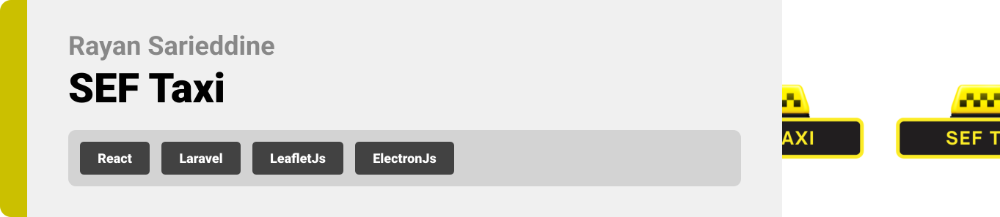

  

<!-- project philosophy -->

> SEF Taxi is a comprehensive taxi app with separate interfaces catering to passengers, drivers, and administrators. It provides a seamless experience for both passengers and drivers while offering efficient administrative tools for effective management.  
> The technologies chosen for development are React for the frontend, Laravel for the backend, and Electron for the administrative side.

## Frontend Development (React)

-intuitive interface for passengers to easily request rides.  
-User can log in/sign up as a passenger/driver.  
-user-friendly interface for drivers to efficiently manage ride requests.  
-Map integration to show and get to location from both driver and passenger side.  
-Users can upload profile pictures.  
-Users car rate the ride once it is finished.

## Backend Development (Laravel)

-JWT for authentication in Laravel.  
-Middleware for securing routes to ensure proper authentication.  
-Chat system between drivers and passengers.  
-Handling different types of operations and requests necessary to maintain the flow of the Taxi App.  
-Laravel's Eloquent ORM for database interactions.  
-Relations in the migrations and models.  
-Error Handling and Input Validation.  
-input validation.

## Desktop App Development (Admin Interface) (Electron)

-Admin can approve any new driver sign up.  
-Admin interface with a dashboard for user management, ride statistics, and administrative tasks.  
-Chat system between administrators, drivers, and passengers as a support bubble.

  

<!-- Prototyping -->

| (./readme/demo/1.png)
| (./readme/demo/2.png)
| (./readme/demo/3.png)
| (./readme/demo/4.png)
| (./readme/demo/6.png)
| (./readme/demo/7.png)
| (./readme/demo/8.png)
| (./readme/demo/9.png)
| (./readme/demo/10.png)
